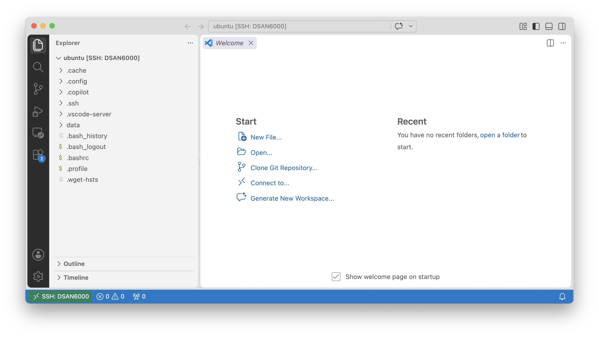
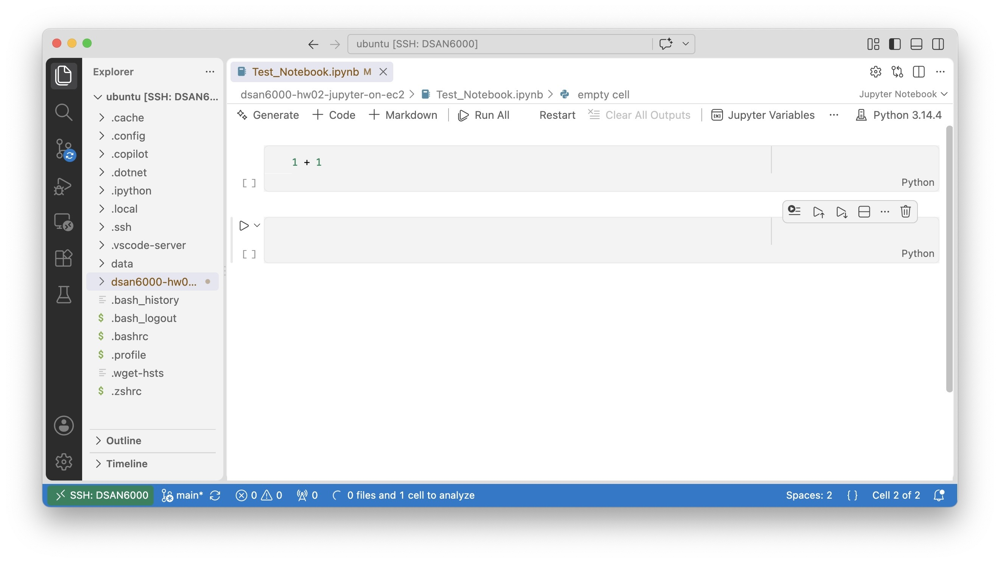

# DSAN 6000 Homework 2: Jupyter on EC2

**Due Friday, September 18, 5:59pm EDT**

> [!WARNING]
> If you have cloned the repository **template** from the `https://github.com/jpowerj/dsan6000-hw02-jupyter-on-ec2` URL, you are **not starting the assignment correctly!** That is, if the command you used to clone the repo onto EC2 looks like:
> 
> `git clone https://github.com/jpowerj/dsan6000-hw02-jupyter-on-ec2`
> 
> This will **not work** for assignments in this course, since you **will not be able to push your changes** back to this repository! (Notice how the above code purposefully has *no copy button!*) Instead, you need to create your **own version of the template**, as described in the next section.

### Creating Your Own Repo From the Template

Click the **green "Use this template" button** in the upper-right corner of the template repo on GitHub, then choose the "Create a new repository" option. On the next page, you will be able to create a **new repository** in **your own GitHub account**, which you should call **`dsan6000-hw02-jupyter-on-ec2`** (the same name as the template).

Once this **derived** repository has been set up on **your GitHub account**, you should first **submit the URL for your newly-created repository on Canvas, immediately after it has been created**: this is what will allow us to see your progress and check any issues between distribution and submission.

Then, once you have submitted the URL on Canvas, **clone *this* newly-created repository (*not* the template owned by `jpowerj`) to your EC2 instance to begin working!** In other words, the command you run on EC2 should look as follows (with your GitHub username in place of `YOUR_GH_USERNAME`):

```bash
git clone https://github.com/YOUR_GH_USERNAME/dsan6000-hw02-jupyter-on-ec2
```

## HW2 Task: Processing OLTP Data With a "Standard" Python Workflow

For this assignment you will be working with the **same data you saw in HW1**, but with the added challenges of:

* (a) Using your **`.pem` public key file** to connect to your EC2 instance from **within VSCode**, and
* (b) Setting up and working with **your own S3 bucket** (rather than just reading data from a publicly-accessible bucket like you did in HW1).

I promise, though, that if you're getting bored/frustrated with all of the setup steps you've had to carry out in these first two homeworks, **they will pay off** when you get to Homeworks 3-9!

The majority of these remaining homeworks will involve the **exact same workflow** as this one (connecting to your EC2 instance using VSCode, and then writing and excecuting Python code remotely). Then the last few assignments and the Final Project will only add on a few additional steps to this workflow.<a name='fn1loc'></a><sup>[1](#fn1)</sup>

## Part 1: Setting Up Your Python Environment

If you followed the in-class demonstration where Jeff walked through how to connect to your EC2 instance from within VSCode, you can start on this part right away!

Otherwise, you can use the full instructions in [this writeup](https://jjacobs.me/dsan6000/writeups/ec2/) on the course website to reach this stage, but the quick summary is as follows:

> [!NOTE]
> ### Connecting to EC2 From VSCode
> 
> 1.  Start your 4-hour **AWS Academy Lab Session** by clicking "Start Lab" from within the "AWS Learner Lab" Module
> 2.  Open the **AWS Console** (the page with a URL that looks like `https://https://us-east-1.console.aws.amazon.com/console/home`)
> 3.  Navigate to the **EC2 Console** (for example, by typing "EC2" into the Search bar at the top of the AWS Console interface)
> 4.  Click "Instances (running)" to view your active EC2 instances
> 5.  Single-click on the row for the instance you'd like to connect to, then look at the instance info panel that appears below the list of instances. Copy the address given in the instance's **Public DNS** field
> 6.  Click the "Warp button" in the bottom-left of the VSCode interface &rarr; "Connect Current Window to Host..." &rarr; "Configure SSH Hosts..." &rarr; Choose the first file that appears in the resulting list of config files
> 7.  Remove the existing DNS address that appears after `HostName` (e.g., the URL starting with `ec2` in `HostName ec2-44-210-233-143.compute-1.amazonaws.com`) and paste the new DNS URL in its place
> 8.  Click the "Warp button" in the bottom-left of the VSCode interface once again &rarr; "Connect Current Window to Host...", but this time select the option corresponding to the `Host` nickname for your EC2 instance (for example, if the portion of your config file containing connection info for the EC2 instance starts with `Host DSAN6000`, then `DSAN6000` should be one of the options in this menu)
> 9.  Finally, click "Open" and then allow VSCode to auto-fill the path (it should auto-fill the path field with your home directory, `/home/ubuntu/`). The list of files and folders stored within your home directory should now appear in the Explorer panel on the left side of the VSCode interface, which means you're ready to clone your repo and start working!

If you followed the writeup and/or the above steps, your VSCode interface should now look something like the following image:



The next step in setting up your Python environment is to use the `uv` package manager to auto-install the necessary libraries for this assignment.

> [!NOTE]
> ### Setting Up `uv`
> 
> In this class, to ensure that the Python libraries necessary for each assignment are installed on your EC2 instance, we will be using the [`uv` package manager](https://docs.astral.sh/uv/). Setting up `uv` and then activating the environment works as follows:
> 
> 1.  If you have not yet installed `uv` on your EC2 instance, run the following command within VSCode's Integrated Terminal:
> 
>     ```bash
>     curl -LsSf https://astral.sh/uv/install.sh | sh
>     ```
> 2.  Now just type `uv sync`, and `uv` will create a new Python environment (within a subdirectory it will create, called `.venv`) where all libraries necessary for this assignment are automatically installed.
> 3.  Once the `uv sync` command has finished running, activate the created environment by executing
> 
>     ```
>     source .venv/bin/activate`
>     ```
> 4. If the environment was activated successfully, the command prompt in VSCode's Integrated Terminal should now have a `(dsan6000-hw02)` prefix. That is, the prompt should look like:
> 
>     ```bash
>     (dsan6000-hw02) ubuntu@ip-172-31-78-63:~/dsan6000-hw02-jupyter-on-ec2$ 
>     ```
>     
>     Instead of
>     
>     ```
>     ubuntu@ip-172-31-78-63:~/dsan6000-hw02-jupyter-on-ec2$ 
>     ```
> 
> 5.  What we've done thus far means that you could now run "plain" `.py` files, and the necessary libraries would be ready for use. However, since we want to utilize **Jupyter notebooks** to write our code, we need to register this environment as a **kernel** that Jupyter can use to execute the code you write within Jupyter notebook code cells. To achieve this, we'll need the `ipykernel` library, which you should now install within your `uv` environment by executing the following command:
> 
>     ```bash
>     uv pip install ipykernel
>     ```
> 
> 6.  Once `ipykernel` has been installed within your `uv` environment, the final step is to **register** this `uv` environment with Jupyter, so that it can be chosen as your desired environment within Jupyter (rather than the default "base" Python environment). To achieve this, execute the following command:
> 
>     ```bash
>     python -m ipykernel install --user --name=hw02-kernel
>     ```
> 7. Once this command has executed successfully, your assignment-specific `uv` environment is now ready for use as a Jupyter kernel! Unfortunately, the only way to get VSCode to detect this new kernel (so that it appears as an option when you choose the kernel for a Jupyter notebook) is by reloading VSCode. But, rather than closing the window and reconnecting, there's an easier approach! Oen the VSCode **Command Palette** using `Ctrl+Shift+P`, then start typing "Reload". You should see the full set of commands filter as you type, leaving the option **"Developer: Reload Window"** near the top. Click this command and your window should reload in the same state, but now with your kernel detected by VSCode.

After you've followed the above steps, open the test notebook file in the root folder of the repo, `Test_Notebook.ipynb`. This notebook contains a single cell, that just computes `1 + 1`, but the point is to test that you can execute this code via the **assignment-specific** `uv` environment you created above.

To test this, click the kernel-chooser menu button in the upper-right of the notebook interface within VSCode. Since this interface defaults to just executing code cells using the "base" Python environment, this button will have an icon followed by something like "Python 3.14.4", as in the upper-right of the interface in the following screenshot:



Once you click the "Python 3.14.4" button, if you've successfully registered the `uv` kernel with Jupyter, you should see a menu appear at the top of the interface. Within this menu, you should be able to choose "Select Another Kernel..." &rarr; "Jupyter Kernel..." &rarr; "hw02-kernel".

Once you've selected this assignment-specific kernel, the button in the upper-right of the notebook interface should now say "hw02-kernel" instead of "Python 3.14.4". You should be able to execute the `1 + 1` code cell now, and see the output `2`.

Your Jupyter development environment is now set up, and you can complete the remainder of the assignment! You will repeat most of this workflow for each of the remaining assignments as well, so making sure you get this part right will pay off throughout the remainder of the class 🙂

## Part 2: Creating, Writing To, and Streaming From a New S3 Bucket

*(Disclaimer: I know the exposition in this section is a bit long-winded, but I promise, everything in this section is included because of its relevance for future assignments and final projects!)*

The main work for this assignment will be to analyze the same data you worked with in HW1, but this time with the data files stored in **your own S3 bucket**, and in the `.parquet` format rather than `.csv`.

You will see that (for reasons we'll explore in a bit more depth in later weeks) this file format **drastically reduces the total size of the Wikipedia data**, from ~180MB to ~30MB. Since part of the billing for S3 usage is based on the total amount of storage space utilized, this translates into a drastic cost reduction as well!

As is the case for all other AWS technologies, S3 buckets can be created in two ways: using the web interface (by accessing the S3 Console from the overall AWS Console), or programmatically using the AWS APIs. Since you already saw what it looks like to instantiate an AWS resource from within the web interface (when you used the EC2 Console to create your EC2 instance from within your browser), here we will take the alternative approach of **creating an S3 bucket programmatically**.

In fact, you already encountered the AWS API in HW1, when you used Linux shell commands to **copy** data from an existing S3 bucket (`s3://dsan6000-wikipedia`) to your EC2 instance. So, another way to think of your task here is just, using **Python** to interact with this API rather than the **Linux shell commands** you used in HW1.

### Part 2.1: Downloading the Hourly Wikipedia Event Data

So, your task is now to **create a new Jupyter notebook** called `hw02-1-download-data.ipynb`, and in this notebook you should write Python code to **download the hourly `.parquet`-format Wikipedia event data from `s3://dsan6000-wikipedia` to a local `data` subfolder**. Just like in HW1, you should create and fill in a `.gitignore` file to ensure that these `.parquet` files downloaded into the `data` subfolder are **not** pushed to GitHub when you push your progress on the assignment!

Keeping the data files in this local folder is perhaps familiar from earlier DSAN course assignments, but a key aspect of this class will be the ability to **distribute computing and data storage** in an efficient manner using "the cloud"! In future assignments, for example, you will be creating a full-on **(Spark) distributed computing cluster**, where each individual computer within the cluster will need to be able to access and transform a given dataset. Thus, we want to move **away from** an approach where our data is "trapped" within a folder on a particular EC2 instance, and **towards** an approach where our data is available to all computers in a cluster.

### Part 2.2: Storing OLTP Events in a Data Lake

The key to achieving this is to instead store your data in an **S3 bucket!** Create a new notebook called `hw02-2-data-lake.ipynb`. Why this name? Because the general process we're carrying out here is an example of the "Data Lake" pattern – this is a big data buzzword you may have heard before, and it just describes the process of "tossing" large amounts of **unstructured** (OLTP) data into a big container. If you imagine your S3 bucket as a humongous bucket filled with water – so much water in such a big bucket that it is like tossing objects into a lake (to be fished out later and **transformed** into OLAP data, which will then be stored in a Data **Warehouse**) – the metaphor starts to make a bit of sense!

Within `hw02-2-data-lake.ipynb`, your job is to:

1.  Create a new S3 bucket, programmatically via the AWS API, named `dsan6000-<YOUR_NETID>`. In other words, if your NetID was `abc123`, your bucket would be called `dsan6000-abc123`, and its S3 URI would be `s3://dsan6000-abc123`.
2.  Take the `.parquet` files you've stored locally in the `data` subfolder, and add them into a "subfolder" within this bucket called `wikipedia-hourly`.

Note that (unlike the `s3://dsan6000-wikipedia` bucket that you **extracted** the data from) the contents of *your* S3 bucket **should not be publicly-accessible!** This is the default setting when you create an S3 bucket using the AWS API, so this shouldn't require any sort of custom setting or option specification on your part.

The "official" Python API for interacting with AWS (so, the library providing Python equivalents to the Linux commands like `aws s3 cp` that you used in HW1) is called **Boto3**, and you can find the documentation for this library [here](https://docs.aws.amazon.com/code-library/latest/ug/python_3_s3_code_examples.html) (it is included among the libraries that are automatically installed when you run `uv sync`!)

### Part 2.3: Analyzing Data Directly from S3

Finally, once the hourly `.parquet` files have been successfully added to your S3 bucket, create a new notebook called `hw02-3-hourly-plots.ipynb`. In this notebook, you will get your first practice **analyzing data directly from an S3 bucket** rather than data stored locally!

That is, you should use Pandas' `pd.read_parquet()` function to carry out the steps in this sub-part, but it **should *not* load the `.parquet` files directly from the `data` subfolder!**<a name='fn2loc'></a><sup>[2](#fn2)</sup> From prior DSAN courses, you are used to using Pandas' IO functions like `pd.read_csv()` with *local* filepaths, like `pd.read_csv("my_data.csv")`. However, it turns out that `pd.read_csv()`, `pd.read_parquet()`, and other Pandas IO functions **also accept S3 URIs**, for S3 buckets that you have permission to access!

To see this functionality in action, for example, you can try this with a URI for one of the S3 bucket files from HW1:

```python
hour_df = pd.read_parquet("s3://dsan6000-wikipedia/hourly_parquet/20260901_040000.parquet")
hour_df.head()
```

Since you have access to this S3 bucket, a code cell with these two lines should output the first five rows (first five events) from the first hour of Wikipedia data from HW1!

So, your job is to load data from your own S3 bucket, where you stored your own copies of the hourly `.parquet` files, in `hw02-3-hourly-plot.ipynb`. Though we will learn more efficient ways to process data like this in **chunks**, in future weeks, for now you can just construct a giant `DataFrame` containing all of the events across the entire dataset. For example, you can use a loop to load each of the hourly files into a Pandas `DataFrame`, then combine each of these hourly `DataFrame`s into one giant `DataFrame` using `pd.concat()`.

Once you have this combined `DataFrame`, spanning all 24 hours of the full dataset, in the final two code cells of your notebook you should use `seaborn` to produce two line plots visualizing **hourly event counts**. While these plots should be displayed within the outputs of the relevant code cells, they should **also be exported to an `images` subfolder within your repo, in *both* `.png` *and* `.svg` formats** (with filenames as specified below), so that graders can quickly see your results without having to open your notebooks:

* In the first plot, visualize the **total** number of events per hour. Export this plot as `images/hourly-events.svg` and `images/hourly-events.png`.
* In the second plot, visualize the hourly event counts **by type**: by using the `hue` option available in Seaborn, you should be able to generate a plot where each event type is represented by a different color, with a legend allowing the audience to see what tye of event each color represents. Export this plot as `images/events-by-type.svg` and `images/events-by-type.png`.

## Part 3: Submission

Once you have completed the above steps, your local repository (on EC2) should contain the following **new** files (that is, on top of the files that were originally provided, in your copy of the repo template):

* `hw02-1-download-data.ipynb`
* `hw02-2-data-lake.ipynb`
* `hw02-3-hourly-plots.ipynb`
* `images/hourly-events.svg`
* `images/hourly-events.png`
* `images/events-by-type.svg`
* `images/events-by-type.png`

Note the absence of any `.parquet` files, and the absence of a `data` subfolder! You will work with these files in Part 2.2, but you can think of them as temporary files: they only exist "ephemerally" on your EC2 drive to facilitate transfer from the `s3://dsan6000-wikipedia` bucket to the newly-created bucket in your account.

Since you submitted your GitHub URL all the way up at the top of the instructions, all that is left is for you to **push your work from EC2 to GitHub**. If you push a commit with the commit message **"Final submission"** (by running `git commit -m "Final submission"` and then `git push`), we will consider your repo ready to grade – otherwise, if no commit with this message is found, we will consider the **most recent commit when the due date is reached** to be your final submission.

---

<a name="fn1">1</a>. As a preview: you will launch **web servers** that will run on a particular **port** on your EC2 instance, then you will make requests to this server from your local laptop via **port forwarding**. [↩︎](#fn1loc)

<a name="fn2">2</a>. To really drive this point home: your submission will have points deducted if `hw02-3-hourly-plots.ipynb` interacts in any way with the `data` subfolder! The point is that, as mentioned above, we want to work towards code that we can **distribute** out to various computers in a cluster, without also requiring each of these computers to have its own local copy of the data. [↩︎](#fn2loc)

---

Assignment hash: `818283d2eb1ab4323c105aca8b963ee617906a6278e0358a705c6bd2befcd8f3`
